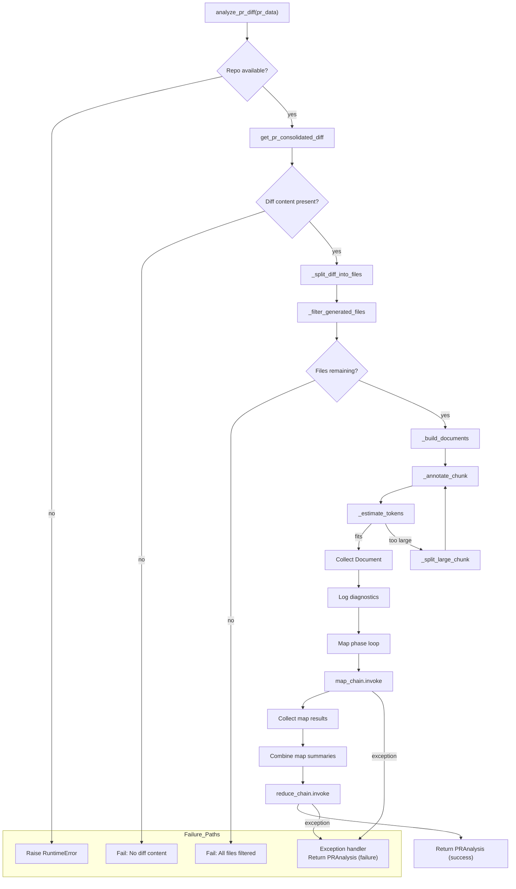
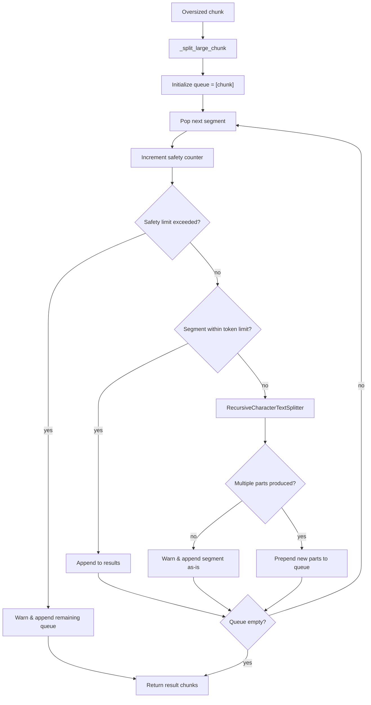
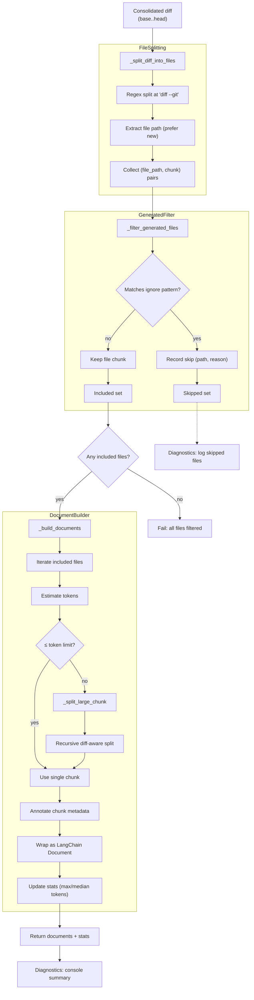

# PRDiffAnalyzer Flow Overview

This document describes the end-to-end processing flow executed by the `PRDiffAnalyzer` class (`pr_diff_analyzer.py`). The analyzer converts a merged pull request into a concise, structured summary suitable for embedding and downstream semantic search.

## High-Level Responsibilities

1. **Initialization**: Configure the Ollama-backed LLM, token estimator, diff splitters, and generated-file filters.
2. **Diff Acquisition**: Fetch the consolidated diff (`base..head`) for the supplied PR metadata.
3. **Filtering & Chunking**: Remove low-value/generated files, then split remaining diff content into token-aware chunks per file.
4. **Map Stage**: Run the map prompt over each chunk to extract factual bullet points.
5. **Reduce Stage**: Combine map outputs with PR metadata to produce a final, structured report.

## Detailed Flow

### Recursive Chunk Splitting Detail

## Method Interactions

- `__init__`
  - Configures `ChatOllama`, token estimation (`tiktoken` when available), diff splitters, and ignore patterns.
  - Warns if instantiated without a repository path.

- `_build_ignore_patterns` / `_should_ignore_file`
  - Provide repository-specific heuristics to drop generated or low-value files before analysis.

- `_split_diff_into_files`
  - Breaks the consolidated diff at each `diff --git` header, tracking the new file path.

- `_build_documents`
  - Applies token estimation per file diff; oversized chunks are split via `_split_large_chunk` and annotated with file/path metadata for downstream prompts.

- `_split_large_chunk`
  - Recursively splits text until each segment falls under the token threshold, using `RecursiveCharacterTextSplitter` with diff-aware separators.

- `analyze_pr_diff`
  - Orchestrates the full pipeline: diff retrieval → filtering → chunking → map loop → reduce synthesis.
  - Emits rich console diagnostics (file skip reasons, token stats, map previews) aiding manual validation.

## Diagnostics & Logging

- Console output summarizes included vs. filtered files, chunk counts, and estimated token sizes.
- Map phase logs per-chunk previews/responses (limited to the first few chunks) for debugging prompt quality.
- Errors surface with `analysis_successful=False` while retaining context in `failure_reason`.

## Diff Splitting & Filtering Flow

