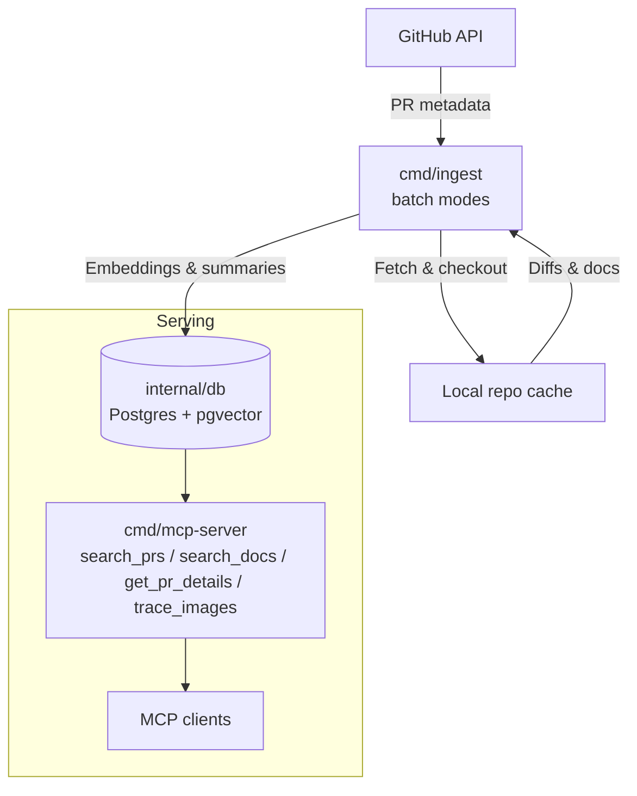

# ARO-HCP IntelHub

ARO-HCP IntelHub captures releases, incidents, and documentation into a change-aware knowledge fabric. It links pull requests, deployments, and operational notes so SREs can ask what changed, why it changed, and how to respond, all through the MCP interface.

## Architecture Snapshot

- `cmd/ingest` runs as a batch job: it pulls PR metadata from GitHub, syncs local clones, computes diffs/docs, and generates embeddings via Ollama.
- `internal/db` stores the precomputed metadata, embeddings, and document chunks in Postgres with pgvector for serving.
- `cmd/mcp-server` runs continuously, exposing `search_prs`, `search_docs`, `get_pr_details`, and `trace_images` backed entirely by precomputed content.

## Local Development Workflow

1. **Configure**: Copy and tweak environment defaults (`cp config.env config.local.env`) or export variables directly.
2. **Start Postgres**: `make compose-up` launches the pgvector-enabled database via docker-compose.
3. **Bootstrap Schema**: `make db-bootstrap` (or `make compose-db-bootstrap`) applies migrations using `cmd/dbctl`.
4. **Ingest Data**:
   - Fast metadata only: `EXECUTION_MODE=CACHE make run-ingest`
   - Full pipeline: `make run-ingest`
5. **Run MCP Server**: `make run-mcp` starts the JSON-RPC endpoint for MCP clients.
6. **Cleanup**: `make compose-down` stops the local Postgres container when you are done.

Additional tooling: `make db-status` checks connectivity, `make db-verify` validates migrations, and `make trace-images` offers a CLI for image-to-source tracing.

