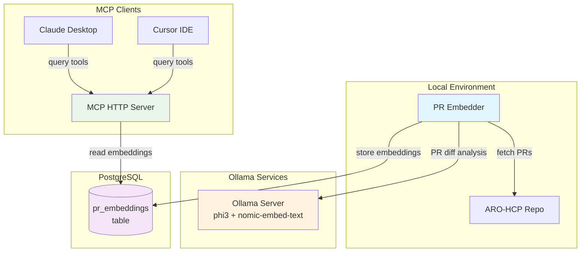

# ARO-HCP AI-Assisted Observability PoC

AI-powered PR analysis system for Azure Red Hat OpenShift Hosted Control Planes (ARO-HCP) using semantic embeddings and model-based PR diff analysis.

## Architecture



## Quick Setup

### 1. Python Environment Setup

```bash
# Install dependencies and create virtual environment
make install-dev

# Check system dependencies
make check-deps
```

### 2. Ollama Setup (Required)

The system requires Ollama for AI-powered diff analysis and embeddings. You can run it locally or on a remote GPU server for better performance.

#### Local Installation

```bash
# Install Ollama (Linux/macOS)
curl -fsSL https://ollama.com/install.sh | sh

# Start Ollama service
ollama serve
```

#### Download Required Models

```bash
# Download phi3 model for diff analysis
ollama pull phi3

# Download nomic-embed-text for embeddings (768 dimensions)
ollama pull nomic-embed-text
```

#### Remote GPU Server (Recommended)

For better performance, use a remote GPU enabled server:

1. Install Ollama on your GPU server
2. Download the models on the GPU server
3. Set `OLLAMA_URL=http://your-gpu-server:11434` in `manifests/config.env`

### 3. Create Kubernetes Cluster with PostgreSQL

```bash
# Create kind cluster with cloud-provider-kind (provides LoadBalancer support)
make kind-create

# Deploy PostgreSQL and MCP server to cluster
make k8s-deploy

# Check database status and connection info
make db-status
```

The PostgreSQL database will be exposed via LoadBalancer and accessible from your host machine.

### 4. Configure Environment

```bash
# Configure environment variables
# Edit manifests/config.env to set your configuration
```

Edit `manifests/config.env` to set:
- `POSTGRES_HOST`: LoadBalancer IP (use `kubectl get svc postgresql` to find it)
- `MAX_NEW_PRS_PER_RUN`: Maximum number of PRs to analyze per run (default: 100)
- `PR_START_DATE`: Optional ISO timestamp for earliest merged PR to ingest
- `INGESTION_MODE`: `INCREMENTAL` (default) for newest PRs, `BATCH` for historical backfill
- `GITHUB_TOKEN`: Optional, for higher rate limits
- `RECREATE`: Database recreation mode (no, all, prs)
- `OLLAMA_URL`: Ollama server URL (default: http://localhost:11434)

### 5. Run Embedder Generation

```bash
# Generate embeddings for PRs (using config from manifests/config.env)
make run-generator

# Or run directly:
python embedding_generator.py
```

This will:
- Clone/update the ARO-HCP repository
- Process merged PRs with LangChain-based diff analysis using Ollama
- Generate semantic embeddings using Ollama models
- Store results in PostgreSQL with pgvector

#### Database Recreation Options

Configure database recreation via the `RECREATE` environment variable in `manifests/config.env`:

- `RECREATE=no` (default): Normal incremental processing
- `RECREATE=all`: Drops all embedding tables and processing state, starts completely fresh
- `RECREATE=prs`: Drops pr_embeddings table and clears PR processing state

#### Remote GPU Configuration

For better performance, you can use a remote GPU server for Ollama models by setting `OLLAMA_URL` in `manifests/config.env`:

```bash
# In manifests/config.env
OLLAMA_URL=http://your-gpu-server:11434
```

**⚠️ Warning**: Recreation options will permanently delete existing embeddings and reset processing state!

### 6. Start MCP Server

```bash
# Start HTTP/SSE MCP server
make run
```

The server will be available at `http://localhost:30800/mcp` (or via the LoadBalancer IP).

### 7. Configure AI Clients

#### Cursor IDE

Copy `examples/cursor_mcp_config.json` to your Cursor MCP configuration:

```bash
cp examples/cursor_mcp_config.json ~/.cursor/mcp_config.json
```

Update the IP address in the config file:
```json
{
  "aro-hcp-embeddings": {
    "url": "http://YOUR_LOADBALANCER_IP:30800/mcp",
    "headers": {
      "Content-Type": "application/json"
    }
  }
}
```

#### Claude Desktop

Add the MCP server to your Claude Desktop config:

```bash
# Copy template and edit
cp examples/claude_desktop_config.template.json ~/.config/claude/claude_desktop_config.json
```

Update the IP address in the configuration.

## Usage

Once configured, you can use these MCP tools in Cursor or Claude:

- **`search_prs`**: Search through PR embeddings  
- **`get_pr_details`**: Get detailed PR information
- **`get_pr_commits`**: Get the list of commits included in a specific PR
- **`search_by_timeframe`**: Find recent PRs by time period
- **`get_related_prs`**: Find PRs related to specific commits

### Example Queries

- "What PRs modified the frontend API?"
- "Find PRs that reference Prometheus metrics"
- "Get the commits included in PR #2683"
- "Show me all PRs that include commit abc123"
- "Summarize PRs merged in the last 7 days"

## Key Features

- **LangChain + Ollama Integration**: Map-reduce PR diff analysis using phi3 via Ollama
- **Remote GPU Support**: Connect to GPU servers for accelerated model inference  
- **768-Dimensional Embeddings**: High-quality embeddings using nomic-embed-text via Ollama
- **Smart Diff Chunking**: Intelligent splitting preserves file boundaries and semantic units
- **PR-Commit Relationship Tracking**: Links PRs to their constituent commits
- **Rich Semantic Search**: Embedding-based search with similarity scoring
- **Honest Failure Reporting**: Clear indicators when analysis cannot be performed

## Development

```bash
# Run code quality checks
make check

# View logs from embedder jobs
make k8s-logs

# Clean up
make kind-delete  # Remove cluster
make clean-all    # Remove all generated files
```

## Database Schema

The system uses PostgreSQL with pgvector extension:
- `pr_embeddings`: PR data with semantic analysis
- Vector similarity search with cosine distance

## Components

- **`embedding_generator.py`**: Main PR embedding pipeline
- **`mcp_server.py`**: FastAPI MCP server
- **`pr_diff_analyzer.py`**: LangChain-based PR diff analysis via Ollama
- **`manifests/`**: Kubernetes deployment files
- **`examples/`**: Client configuration templates
