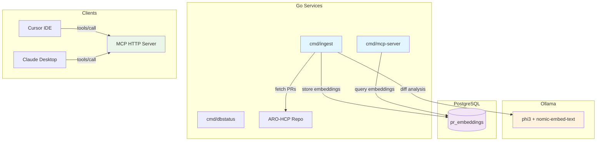

# ARO-HCP AI-Assisted Observability (Go Port)

Go implementation of the ARO-HCP pull-request analysis pipeline and MCP tooling. It ingests merged PRs from the Azure Red Hat OpenShift Hosted Control Plane repository, summarizes diffs with an LLM, stores semantic embeddings, and exposes MCP tools for IDE assistants.

## Architecture



## Prerequisites

- Go 1.24 or newer
- Docker or Podman (for container targets)
- Kind + kubectl (for local Kubernetes workflow)
- Running Ollama instance with `phi3` and `nomic-embed-text`
- PostgreSQL with the `pgvector` extension (in-kind target provisioning provided)

## Project Layout

- `cmd/ingest`: incremental/batch PR ingestion and embedding generator
- `cmd/mcp-server`: HTTP/SSE MCP server exposing `search_prs`, `get_pr_details`, `trace_images`
- `cmd/dbstatus`: utility that tests database connectivity (used by `make db-status`)
- `internal/ingestion`: GitHub fetcher, diff analyzer, embedding writer
- `internal/mcp`: services and adapters for MCP tooling
- `internal/tracing`: image tracing pipeline (Skopeo-based)
- `config-go.env`: configuration file consumed by Go binaries and container image
- `Makefile`: Go-centric automation (build/test/container/kind/k8s)
- `Dockerfile`: multi-stage build that emits static binaries on top of Distroless

## Quick Start

### 1. Configure Environment

Copy or update `config-go.env` with the desired settings. Important keys:

- `postgres_url`: Postgres DSN (or use the kind workflow below)
- `ollama_url`: location of your Ollama server (local or remote GPU)
- `aro_hcp_repo_path`: local clone path used by diff analysis and tracing
- `pull_secret`: optional path to Docker config JSON for private registries

### 2. Install Dependencies & Run Checks

```bash
make tidy         # go mod tidy
make fmt          # gofmt on all packages
make lint         # go vet (+ staticcheck if present)
make test         # go test ./... -cover
```

### 3. Run Services Locally

```bash
make run-ingest   # go run ./cmd/ingest
make run-mcp      # go run ./cmd/mcp-server
make db-status    # go run ./cmd/dbstatus
```

The ingest command uses the configuration in `config-go.env` to fetch merged PRs, generate rich diff summaries with the embedded LLM, compute embeddings, and persist them into Postgres.

### 4. Container Workflow

```bash
make container-build        # builds using go/Dockerfile
make container-run          # run the container with manifests/config.env
make container-push         # upload to $(IMAGE_REGISTRY)
```

The resulting image contains:

- `/usr/local/bin/ingest`
- `/usr/local/bin/mcp-server`
- `/usr/local/bin/dbstatus`

The default entrypoint launches the MCP server; override with arguments for other commands.

### 5. Kind + Kubernetes

```bash
make kind-create   # builds image, boots kind, loads image, starts cloud-provider-kind
make k8s-deploy    # applies manifests from ../manifests
make db-status     # verifies connectivity (prefers LoadBalancer IP)
# ...
make k8s-logs
make k8s-undeploy
make kind-delete
```

The provided manifests stand up PostgreSQL (with pgvector), the MCP server deployment, and supporting services.

## MCP Tooling

When `cmd/mcp-server` is running, the following tools are available to MCP clients via HTTP/JSON-RPC:

- `search_prs`
- `get_pr_details`
- `trace_images`

Sample `curl` call:

```bash
curl -X POST http://localhost:8000/mcp/jsonrpc \
  -H 'Content-Type: application/json' \
  -d '{
        "jsonrpc": "2.0",
        "id": "tool-test",
        "method": "tools/call",
        "params": {
          "name": "trace_images",
          "arguments": {
            "commit_sha": "<SHA>",
            "environment": "int"
          }
        }
      }'
```

Update `examples/cursor_mcp_config.json` or the Claude Desktop configuration with the MCP endpoint (`http://host:8000/mcp/jsonrpc`).

## Development Tips

- The ingest pipeline respects `ingestion_mode`, `ingestion_limit`, and `recreate` values from `config-go.env`.
- Diff analysis relies on the local clone path and the Ollama endpoint; ensure both are reachable.
- `internal/tracing` shells out to `skopeo`; provide a pull-secret if private registries are required.

## License

This proof of concept follows the licensing of the parent repository. Refer to `../LICENSE` for details.

